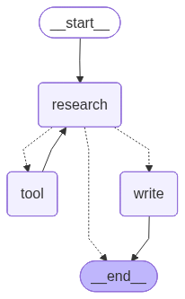

# Multi-agent Article Generator

This app takes a user query, searches the web for relevant information, and generates a well-crafted article with citations.  
It uses a multi-agent workflow to split responsibilities between research and writing.

---

## Agents

### Research Analyst Agent
- Accepts a topic from the user.  
- Uses the Travily web search tool to fetch results from the internet.  
- Consolidates and curates the search results for further processing.  

### Content Writer Agent
- Takes the curated results.  
- Produces a polished, publication-ready article with proper citations.  

---

## Agent Graph



---

## Setup & Run

### 1. Pull and serve the model with Ollama
```bash
ollama pull qwen3:8b
ollama serve
```

### 2. Run the app
```bash
cd src
export PYTHONPATH="$PYTHONPATH:."
python app/app.py
```
